# Serverless Photo Gallery

## Cloud/AWS project - practice using cloud technologies & AWS services by building a photo gallery web app with scalable, serverless architecture

### Project Goals
The goal of this project is to gain experience designing and implementing serverless architecture using AWS services.

### Project Description
'Serverless Photo Gallery' is a cloud-based photo gallery application that allows users to interact with a web interface hosted on Amazon S3, where they can upload photos, view their gallery, and delete images.

AWS services are leveraged to provide a scalable, serverless architecture requiring minimal infrastructure management.

The backend logic is handled by AWS Lambda, which processes image uploads and deletions, while metadata is stored in Amazon DynamoDB.

The application is designed to dynamically fetch and display images from Amazon S3, offering a fast and cost-efficient solution for hosting a photo gallery without the management of servers.

## User Stories
From the perspective of the cloud professional:

- As a future cloud professional, I want to create a Lambda function that allows users to upload images through the web application, so that the images are stored in Amazon S3 and the metadata is saved in DynamoDB for future retrieval

- As a future cloud professional, I want to build a frontend that dynamically fetches image URLs from DynamoDB and displays them by retrieving the image files from Amazon S3, so that users can view all their uploaded photos in the gallery

- As a future cloud professional, I want to implement an API endpoint through API Gateway and Lambda that allows users to delete images from the gallery, ensuring that both the image file in S3 and the corresponding metadata in DynamoDB are removed

From the perspective of the user:

- As a user, I want to easily upload images through the web interface, so that I can store and view my photos in an online gallery

- As a user, I want to be able to see all of my uploaded images displayed in a gallery, so that I can browse and view them conveniently

- As a user, I want to delete any unwanted images from my gallery, so that I can manage my photo collection and remove photos I no longer need

## Design Choices

### Architecture Diagrams

**Architectural overview:**

**Upload architecture:**

**View architecture:**

**Delete architecture:**

***
### AWS Infrastructure

### - Amazon S3
- Create and configure S3 bucket to serve as both a storage solution for uploaded images and as a host for the static web app: update bucket policy to allow public read access; configure CORS to allow the web app to directly communicate with the bucket. Steps 1-3 completed using the AWS management console, steps 4-5 completed using AWS CLI in bash terminal.

***Step 1*** - **Create an S3 Bucket**

***Step 2*** - **Set the S3 bucket policy** (make bucket objects publicly accessible so users can retrieve their photos via the application)

*Policy explanation:*

`"Version": "2012-10-17":` *language version*

`"Sid": "PublicReadGetObject"` *policy identifier*

`"Effect": "Allow"` *"ALLOW"*

`"Principal": "*"` *"ALL USERS"* ("*" means apply policy to all users)

`"Action": "s3:GetObject"` *"TO PERFORM THE GetObject ACTION"* (i.e. retrieve objects (images) from the bucket)

`"Resource": "arn:aws:s3:::photo-gallery-images-{your-unique-id}/*"` *"APPLY POLICY TO ALL BUCKET OBJECTS"*

***Step 3*** - **Enable Cross-Origin Resource Sharing** (because using serverless architecture, i.e. the web app communicates directly with S3 to perform operations. Since the frontend and S3 are on different domains (i.e., the browser’s domain and AWS’s domain), this is a cross-origin request)

*Configuration explanation:*

`"AllowedHeaders":["*"]` *"ALLOW THE BROWSER TO SEND ANY HTTP HEADERS IN THE REQUEST TO THE S3 BUCKET"*

`"AllowedMethods":["GET", "HEAD"]` (define HTTP methods permitted for cross-origin requests)

`"GET"` *"ALLOW CLIENT TO RETRIEVE RESOUCES FROM BUCKET"*

`"HEAD"` *"ALLOW CLIENT TO REQUEST RESOURCE METADATA"*

`"AllowedOrigins":["*"]` *"ALLOW ANY ORIGIN (DOMAIN) TO SEND CROSS-ORIGIN REQUESTS TO BUCKET"* (restrict to specific origins for increased security)

***Step 4*** - **Enable static hosting on S3 bucket** (enable S3 bucket to serve web app (expose `app` files via a web URL))

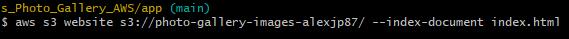

***Step 5*** - **Verify static hosting enabled**

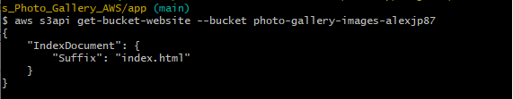

***Step 6*** - **Upload static website (/app) files**

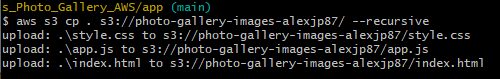

***Step 7*** - **Verify static website files uploaded**

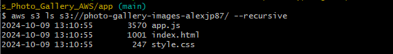

***

### - Amazon DynamoDB
- Create DynamoDB table to serve as storage solution for uploaded image metadata: configure AWS CLI; create table; verify table creation; test table by creating sample record and querying to verify the record was created; delete record before verifying deletion was successful. Steps completed using AWS CLI in bash terminal.

***Step 1*** - *Configure AWS CLI* (using access key ID and secret access key contained in 'admin_credentials', specify default region name and ouput format)

***Step 2*** - *Create Table*

*Create table explanation:* (`\` is a line continuation symbol, used for command readability):

`aws dynamodb create-table` *"CREATE A DynamoDB TABLE"*

`--table-name photoGallery` *"NAME THE TABLE photoGallery"*

`--attribute-definitions AttributeName=photoId,AttributeType=S` *"DEFINE 1 ATTRIBUTE FOR THE TABLE, NAME=photoId, TYPE=String (`S`)"*

`--key-schema AttributeName=photoId,KeyType=HASH` *"DEFINE THE TABLE PRIMARY/PARTITION KEY AS photoId"*

`--provisioned-throughput ReadCapacityUnits=5,WriteCapacityUnits=5` *"SET TABLE READ AND WRITE CAPACITY UNITS"* (Used to enhance cost and performance optimisation, ReadCapacityUnits=5 specifies that the table will be able to handle 5 reads per second, WriteCapacityUnits=5 specifies that the table will be able to handle 5 writes per second)

The json output currently displays `"TableStatus": "CREATING"`. This status will change to active once the table is ready for use.

***Step 3*** - *Verify table creation*

***Step 4*** - *Add test item to table* (include `"photoId"`, `"title"` and `"url"` for `--item`)

***Step 5*** - *Verify item creation* (by default, `scan` returns all attributes for all items in a table)

***Step 6*** - *Delete test item* (primary key `"photoId": {"S": "1"}` necessarily used to specify item for delete)

***Step 7*** - *Verify item successfully deleted* (`scan` output shows empty table)

***

### - AWS IAM:
- Create an IAM role allowing AWS Lambda to assume access to S3 and DynamoDB: Create trust policy; attach trust policy to IAM role; verify role was created; attach AWS-managed policies to role allowing full access to Amazon S3 and Amazon DynamoDB services; verify policies were attached. Steps completed using AWS CLI in bash terminal.

***Step 1*** - *Create trust policy json file* (permits AWS Lambda to assume IAM role)

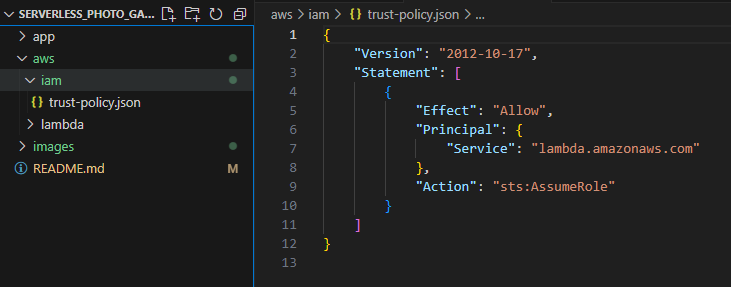

***Step 2*** - *Create IAM role, attaching trust policy*

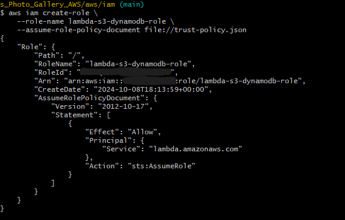

***Step 3*** - *Verify IAM role was created*

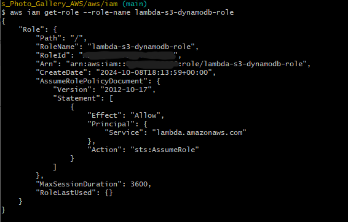

***Step 4*** - *Attach AWS-managed policy (for full S3 access)*

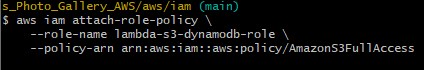

***Step 5*** -  *Attach AWS-managed policy for full DynamoDB access*

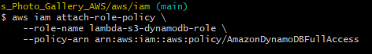

***Step 6*** - *Verify policies were attached to IAM role*

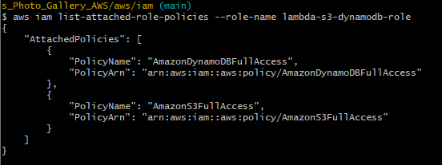

***

### - Amazon API Gateway
- Create an Amazon API Gateway REST API to route requests: create API; create and verify resource (/photos); create and verify GET, POST and DELETE resource methods; deploy API. Steps completed using AWS CLI in bash terminal.

***Step 1*** - *Create REST API* (routes operation requests to Lambda)

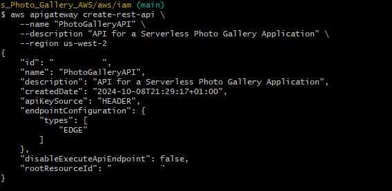

***Step 2*** - *Create API resource*

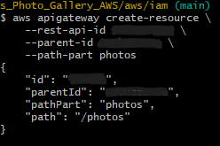

***Step 3*** - *Verify resource was created*

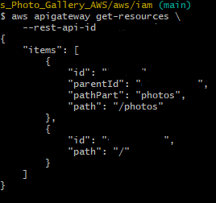

***Step 4*** - *Create GET, POST and DELETE resource methods* (`"authorizationType": "NONE"` allows method access without credentials)

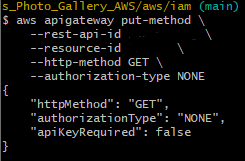

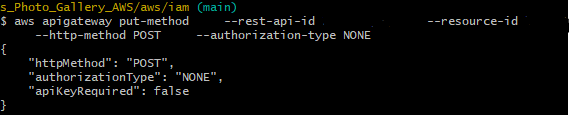

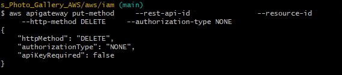

***Step 5*** - *Verify all resource methods were created*

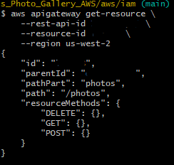

***Step 6*** - *Deploy API Gateway API* (Make available to clients) (`--stage-name prod` deploys API to Production stage)

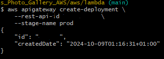

***

### - AWS Lambda
- Create and deploy Lambda functions (written in Node.js) for fetch, upload and delete operations (SEE </aws/lambda/> .js files for code breakdown) Create and deploy Lambda functions; integrate Lambda functions with API Gateway. Steps completed using AWS CLI in bash terminal.

***Step 1*** - *Create and deploy `FetchPhotos` function* (specify the function's runtime, execution role, and handler, plus other attributes, and provide the Lambda function code as a ZIP file)

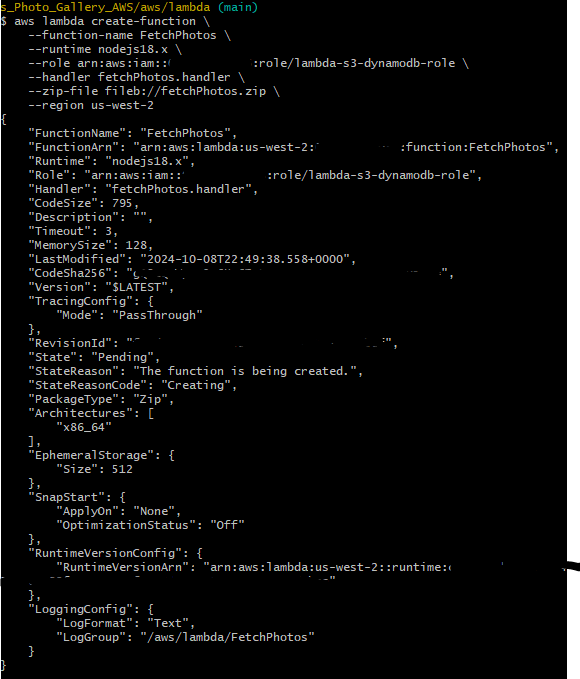

*Create and deploy Lambda function explanation:*

`aws lambda create-function` *Initiate creation of FetchPhotos Lambda function*

`--runtime nodejs.18.x` *Configure function to run Node.js 18.x*

`--zip-file fileb://fetchPhotos.zip` *Function code packaged in a ZIP file*

`--role arn:aws:iam:: ...` *Define AWS Lambda function permissions through IAM role 'lambda-s3-dynamodb-role'*

`--handler fetchPhotos.handler` *Define Lambda entry point as handler function in the fetchPhotos.js file* (handler function executed when Lambda function is invoked (e.g. user makes request to view gallery))

***Steps 2 and 3*** - *Repeat Step 1 for `UploadPhoto` and `DeletePhoto` functions*

***Step 4*** - *Integrate `DeletePhoto` Lambda function with API Gateway resource DELETE method*

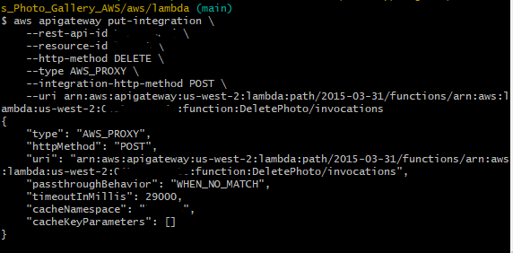

*Integrate function with API explanation:*

`aws apigateway put-integration` *AWS CLI command for integrating an API Gateway resource* (i.e. /photos, with a backend service (e.g. a Lambda function))

`--resource-id` *API Gateway resource (i.e. /photos) ID where Lambda function will be triggered*

`--type AWS_PROXY` *API Gateway to use Lambda proxy integration* (where the entire HTTP request (including headers, path parameters, and query parameters) is passed directly to the Lambda function, and the function's output is returned to the client as an HTTP response)

`--integration-http-method POST` *Specify that API Gateway will send the request to Lambda as a POST request* (POST requests are how API Gateway invokes Lambda functions)

***Steps 5 and 6*** - *Repeat Step 4 for `UploadPhoto` (integrate with resouce POST method) and `FetchPhotos` (integrate with resource GET method) functions*

***

### Technologies Used

AWS Services:
- Amazon S3 (static hosting/storage)
- Amazon DynamoDB
- AWS IAM
- Amazon API Gateway
- AWS Lambda

Languages:
- HTML
- CSS
- JavaScript

Version control:
- Git
- Github

Diagrams:
- Diagrams.net

