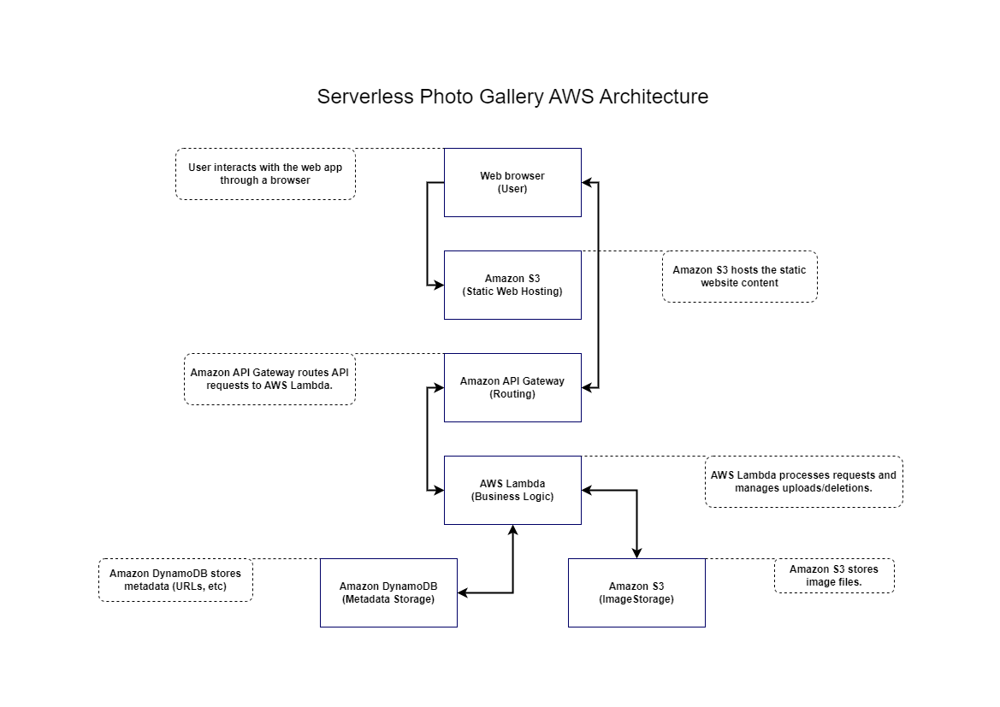
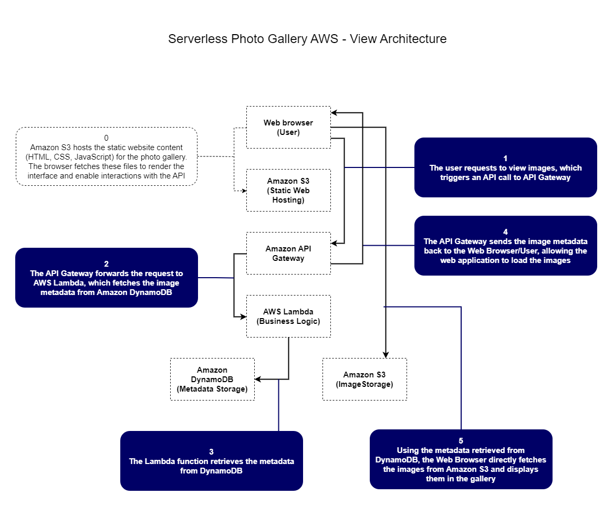
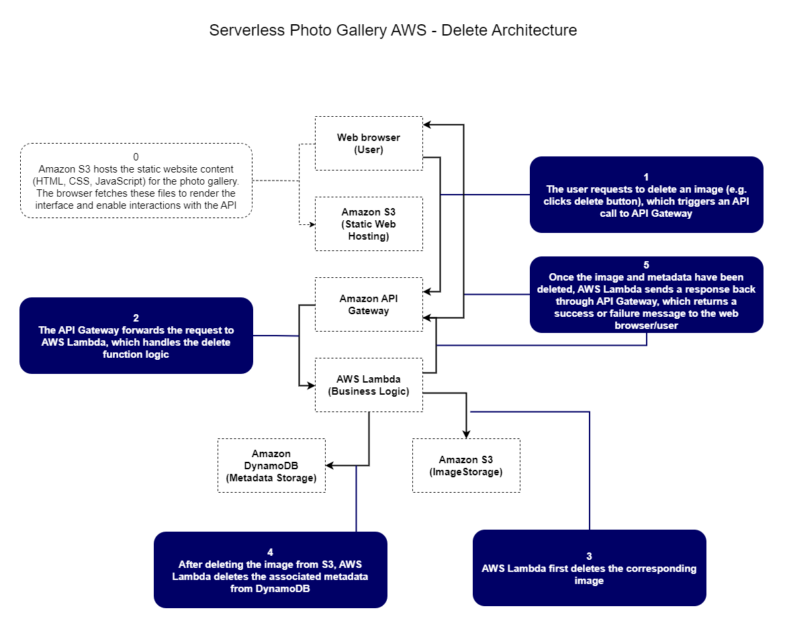
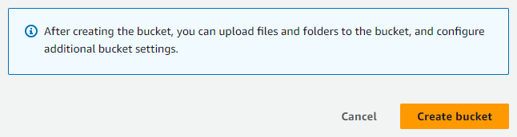
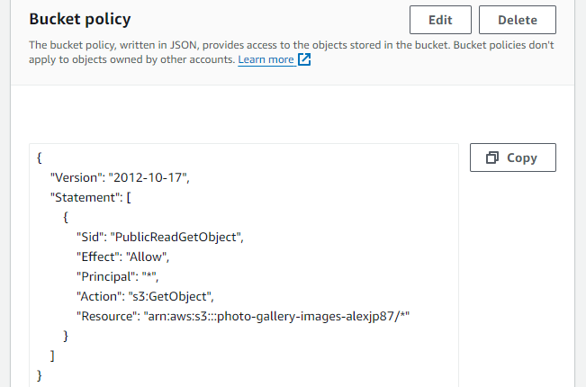

# Serverless Photo Gallery

## Cloud/AWS project - practice using cloud technologies & AWS services by building a photo gallery web app with scalable, serverless architecture

### Project Goals
The goal of this project is to gain experience designing and implementing serverless architecture using AWS services.

### Project Description
'Serverless Photo Gallery' is a cloud-based photo gallery application that allows users to interact with a web interface hosted on Amazon S3, where they can upload photos, view their gallery, and delete images.

AWS services are leveraged to provide a scalable, serverless architecture requiring minimal infrastructure management.

The backend logic is handled by AWS Lambda, which processes image uploads and deletions, while metadata is stored in Amazon DynamoDB.

The application is designed to dynamically fetch and display images from Amazon S3, offering a fast and cost-efficient solution for hosting a photo gallery without the management of servers.

### User Stories
From the perspective of the cloud professional:

- As a future cloud professional, I want to create a Lambda function that allows users to upload images through the web application, so that the images are stored in Amazon S3 and the metadata is saved in DynamoDB for future retrieval

- As a future cloud professional, I want to build a frontend that dynamically fetches image URLs from DynamoDB and displays them by retrieving the image files from Amazon S3, so that users can view all their uploaded photos in the gallery

- As a future cloud professional, I want to implement an API endpoint through API Gateway and Lambda that allows users to delete images from the gallery, ensuring that both the image file in S3 and the corresponding metadata in DynamoDB are removed

From the perspective of the user:

- As a user, I want to easily upload images through the web interface, so that I can store and view my photos in an online gallery

- As a user, I want to be able to see all of my uploaded images displayed in a gallery, so that I can browse and view them conveniently

- As a user, I want to delete any unwanted images from my gallery, so that I can manage my photo collection and remove photos I no longer need

### Design Choices

#### Architecture Diagrams:

Architectural overview:

Upload architecture:

View architecture:

Delete architecture:

#### AWS Infrastructure:

**Amazon S3:** Create and configure S3 bucket to serve as both a storage solution for uploaded images and as a host for the static web app. Update bucket policy to allow public read access, and configure CORS to allow the web app to directly communicate with the bucket. Steps completed using the AWS management console.

Step 1 - Create an S3 Bucket

Step 2 - Set the S3 bucket policy (make bucket objects publicly accessible so users can retrieve their photos via the application)

Policy explanation:

`"Version": "2012-10-17":` language version

`"Sid": "PublicReadGetObject"` policy identifier

`"Effect": "Allow"` "ALLOW"

`"Principal": "*"` "ALL USERS" ("*" means apply policy to all users)

`"Action": "s3:GetObject"` "TO PERFORM THE GetObject ACTION (i.e. retrieve objects (images) from the bucket)"

`"Resource": "arn:aws:s3:::photo-gallery-images-{your-unique-id}/*"` "APPLY POLICY TO ALL BUCKET OBJECTS" (/* specifies all files)

Step 3 - Enable Cross-Origin Resource Sharing (because using serverless architecture, i.e. the web app communicates directly with S3 to perform operations. Since the frontend and S3 are on different domains (i.e., the browser’s domain and AWS’s domain), this is a cross-origin request)

Configuration explanation:

`"AllowedHeaders":["*"]` "ALLOW THE BROWSER TO SEND ANY HTTP HEADERS IN THE REQUEST TO THE S3 BUCKET"

`"AllowedMethods":["GET", "HEAD"]` (define HTTP methods permitted for cross-origin requests)

`"GET"` "ALLOW CLIENT TO RETRIEVE RESOUCES FROM BUCKET"

`"HEAD"` "ALLOW CLIENT TO REQUEST RESOURCE METADATA"

`"AllowedOrigins":["*"]` "ALLOW ANY ORIGIN (DOMAIN) TO SEND CROSS-ORIGIN REQUESTS TO BUCKET" (restrict to specific origins for increased security)

### Technologies Used

AWS Services:
- Amazon S3 (static hosting/storage)
- Amazon API Gateway
- AWS Lambda
- Amazon DynamoDB

Front-end:
- HTML
- CSS
- JavaScript

Version control:
- Git
- Github

Diagrams:
- Diagrams.net

